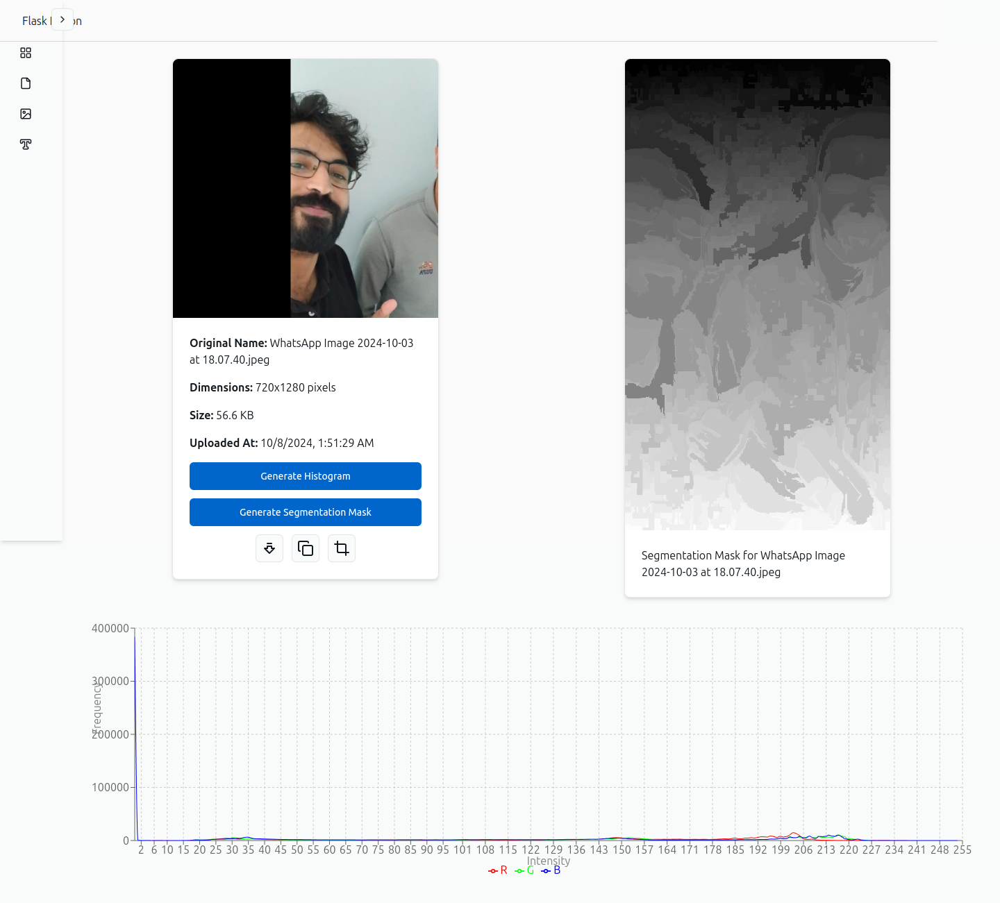

# FlaskFusion Frontend

This repository contains the frontend for the FlaskFusion project.

## Project Overview

This is the front-end client for FlaskFusion, an advanced data analysis and manipulation platform focused on tabular data, image processing, and text analysis. The interface is crafted for usability and aesthetics, featuring smooth animations, responsive layouts, and intuitive data visualizations, allowing users to effortlessly interact with, analyze, and visualize their data.

## Features

- **Intuitive Data Visualization:** Powered by Recharts and Victory, this interface dynamically visualizes data insights from tables to detailed charts.

- **Image Manipulation Tools:** Crop and edit images directly within the app using React Cropper, allowing seamless handling of uploaded images.

- **Interactive Animations:** Built with Framer Motion, animations and transitions enhance the user experience with an engaging, modern feel.

- **Responsive, Styled UI:** Tailwind CSS, Flowbite, and ShadCN ensure the design remains consistent and responsive on all screen sizes.

## Technologies Used

- **Framework:** React (with TypeScript for type safety)
- **State Management:** React Query for server state management
- **API Handling:** Axios for seamless HTTP requests
- **Data Visualization:** Recharts and Victory for advanced charting
- **Image Processing:** React Cropper for image editing
- **Styling:** Tailwind CSS, Flowbite, ShadCN
- **Build Tool:** Vite for fast development and optimized builds

## Installation

## Prerequisites

- Node.js 18 or higher

1. Clone the repository

```bash
git clone https://github.com/Mtanash/FlaskFusion-frontend.git

cd FlaskFusion-frontend
```

2. Install dependencies

```bash
npm install
```

3. Start the development server

```bash
npm run dev
```

4. Open the browser and navigate to http://localhost:5173


5. To build the production bundle, run the following command:

```bash
npm run build
```

## Configuration

Ensure the backend server is running, and update the `BASE_URL` in the `src/config.ts` file to match the URL of the FlaskFusion backend server.

## Usage

- Navigate to the home page at http://localhost:5173

  

- To upload CSV files, navigate to the CSV page at http://localhost:5173/csv

  

- To upload images, navigate to the images page at http://localhost:5173/images

  

- To process text data, navigate to the text page at http://localhost:5173/text

  

## Screenshots




## License

This project is licensed under the MIT License.
